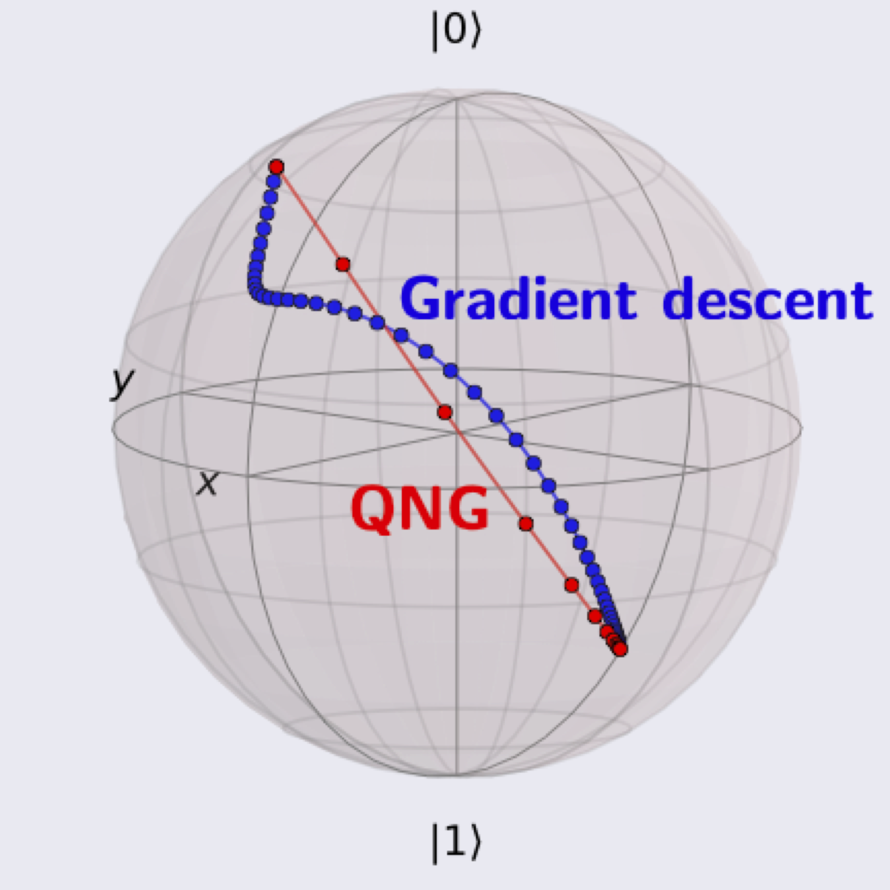

# Accelerating VQEs with Quantum Natural Gradient 

This project repo was created as part of the [Quantum Open Source Foundation (QOSF)](http://qosf.org) Mentorship Program.

Recently, several works, namely [Stokes et al.](https://arxiv.org/abs/1909.02108), have proposed and investigated the use of "quantum natural gradients" (QNG) to accelerate the optimization step of variational quantum algorithms.

To provide an in-depth and intuitive explanation of quantum natural gradients, we wrote the following blogposts:

1. [Rethinking Gradient Descent With Quantum Natural Gradient](https://medium.com/@ziyu.lili.maggie/rethinking-gradient-descent-with-quantum-natural-gradient-330da14f621) by Maggie Li

2. [Gradient Descent from the Ground Up](https://medium.com/@lana.bozanic/quantum-natural-gradient-from-the-ground-up-983db57cbf6) by Lana Bozanic

In addition, we provide several tutorials in this repo for running and analyzing VQE calculations of small quantum systems using quantum natural gradient. We implemented the code in [PennyLane](https://pennylane.ai/) and used routines from [QuTiP](http://qutip.org/) for visualization.

### Tutorials

We investigate the following systems:

1. [Single qubit rotations](https://github.com/hsim13372/quantum_natural_gradient/blob/master/single_qubit_vqe/single_qubit_rotations.ipynb) (where we can visualize the optimization paths on the Bloch sphere)
2. [H2 molecule](https://github.com/hsim13372/quantum_natural_gradient/blob/master/h2/H2_qchem_VQE.ipynb). In this example, we construct the Hamiltonian using PennyLane's `qchem` module. We additionally provide a notebook that runs [Yamamoto](https://arxiv.org/abs/1909.05074)'s simplified Hydrogen example.
3. [LiH molecule](https://github.com/hsim13372/quantum_natural_gradient/blob/master/lih/lih_4qubits.ipynb)

and ran VQE calculations using "vanilla" gradient descent and gradient descent that uses quantum natural gradients for comparison.
We provide several methods for visualizing the performance and optimization paths, and we empirically explore the robustness of QNG to parameter initialization [here](https://github.com/hsim13372/quantum_natural_gradient/tree/master/k_runs).
